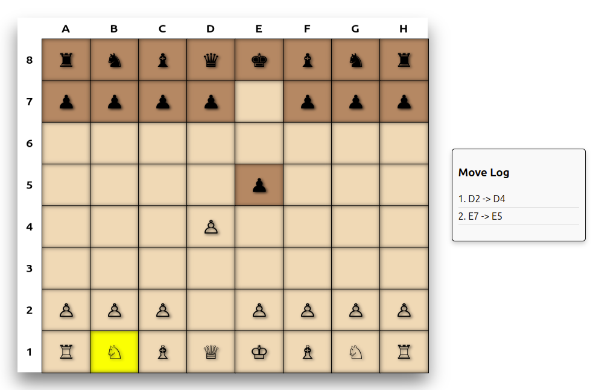

# PHP Chess Engine with DDD, CQRS, and React (Alpha version)

## Description
A chess engine written in PHP with a React frontend, implementing Domain-Driven Design (DDD) and Command Query Responsibility Segregation (CQRS). The application is currently in the alpha stage.

## Features
- Chess engine implementation in PHP  
- React-based frontend chess interface  
- Domain-Driven Design (DDD) architecture  
- Command Query Responsibility Segregation (CQRS) patterns  
- Support for basic chess rules  
- Game saving and replay functionality

## Screenshot

## Technologies
- PHP  
- React.js  
- Symfony (backend)  
- Doctrine ORM (for DDD)  
- PHPUnit (unit testing)  
- Cypress (end-to-end testing)

## Directory Structure

src/ 
├── Game/ 
│   ├── Application/ 
│   │   ├── Command/ 
│   │   ├── Handler/ 
│   │   ├── Query/ 
│   │   ├── Response/ 
│   │   └── Service/ 
│   │ 
│   ├── Domain/ 
│   │   ├── Entity/ 
│   │   ├── Repository/ 
│   │   └── ValueObject/ 
│   │ 
│   ├── UI/ 
│   │   ├── Controller/ 
│   │   └── DTO/ 
│   │ 
│   └── Infrastructure/ 
│       ├── Controller/ 
│       ├── Persistence/ 
│       ├── Service/ 
│       └── Specification/ 
│ 
├── Frontend/ 
│   ├── components/ 
│   ├── services/ 
│   └── pages/ 
│ 
tests/ 
config/ 
docs/ 
